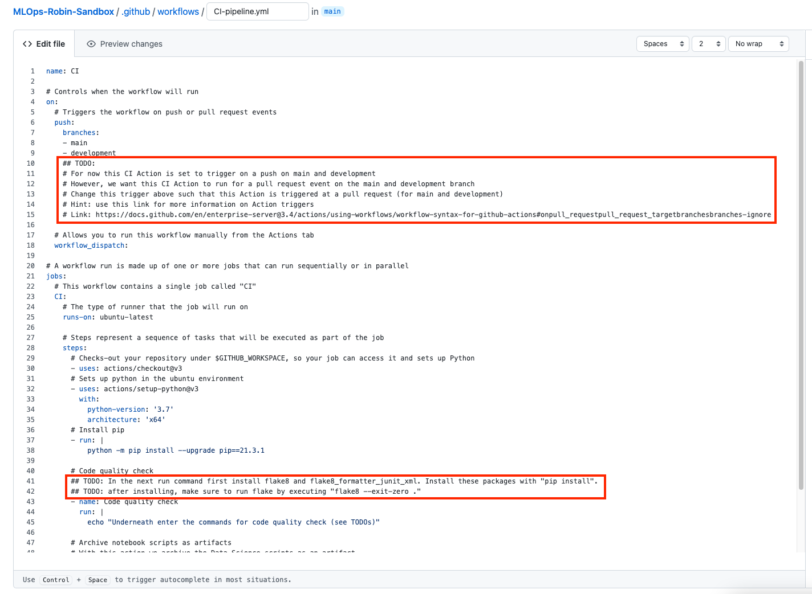

# Data & AI Tech Immersion Workshop - Product Review Guide and Lab Instructions

## Scenario overview

In this experience you will learn how Contoso Auto can use MLOps to formalize the process of training and deploying new models using a DevOps approach.
The Contoso Corporation is a fictional but representative global manufacturing conglomerate. In this tutorial we will use a train script that has already been built to create a model that will predict whether a car is a compliant car, i.e., whether it meets tightening government regulations for low-emission vehicles. The dataset contains information about the condition of car components, type of material and its manufacturing year.

## Technology overview

MLflow uses a Machine Learning Operations (MLOps) approach, which improves the quality and consistency of your machine learning solutions. 
MLflow provides the following MLOps capabilities:

- Integration with pipelines: define continuous integration and deployment workflows for your models.
- Model registry: maintain multiple versions of your trained models.
- Model validation: automatically validate your trained models and select the optimal configuration for deploying them into production.
- Deployment: productionize your models as a web service in the cloud, locally, or to IoT Edge devices.
- Assessment: monitor your deployed model's performance, so you can drive improvements in the next version of the model.

## AI, Experience - MLOps with MLflow and GitHub Actions <TO UPDATE ONCE FINAL>

- [Data & AI Tech Immersion Workshop - Product Review Guide and Lab Instructions](#data---ai-tech-immersion-workshop---product-review-guide-and-lab-instructions)
  * [Scenario overview](#scenario-overview)
  * [Technology overview](#technology-overview)
  * [AI, Experience - MLOps with MLflow and GitHub Actions <TO UPDATE ONCE FINAL>](#ai--experience---mlops-with-mlflow-and-github-actions--to-update-once-final-)
  * [Prerequisite: resource group](#prerequisite--resource-group)
  * [Exercise 1: Setup New Project in GitHub](#exercise-1--setup-new-project-in-azure-devops)
    + [Task 1: Import code from a GitHub Repo](#task-1--import-code-from-a-github-repo)
    + [Task 2: Set Databricks variables as GitHub secrets](#task-2--set-databricks-variables-as-github-secrets)
  * [Exercise 2: Setup and Run the CI Pipeline](#exercise-2--setup-and-run-the-ci-pipeline)
    + [Task 1: Setup the CI Pipeline](#task-1--setup-the-ci-pipeline)
    + [Task 2: Run the CI Pipeline](#task-2--run-the-ci-pipeline)
    + [Task 3: Review output of CI pipeline](#task-3--review-output-of-ci-pipeline)
  * [Exercise 3: Setup the CICD Development Pipeline](#exercise-3--setup-the-cicd-development-pipeline)
    + [Task 1: Setup the CICD Development pipeline](#task-1--setup-the-cicd-development-pipeline)
    + [Task 2: Run the CICD Development Pipeline](#task-2--run-the-cicd-development-pipeline)
    + [Task 3: Review output of CICD Development pipeline](#task-3--review-output-of-cicd-development-pipeline)
  * [Exercise 4 (Extra challenge): Create Production Pipeline](#exercise-4--extra-challenge---create-production-pipeline)
    + [Task 1: Setup, run and review a CICD-prod pipeline](#task-1--setup--run-and-review-a-cicd-prod-pipeline)
  * [Exercise 5: Setup and Run the Train Pipeline](#exercise-5--setup-and-run-the-train-pipeline)
    + [Task 1: Setup the Azure DataFactory environment](#task-1--setup-the-azure-datafactory-environment)
    + [Task 2: Create the train pipeline](#task-2--create-the-train-pipeline)
    + [Task 3: Run the Train Pipeline](#task-3--run-the-train-pipeline)
    + [Task 4: Review Train Outputs](#task-4--review-train-outputs)
  * [Exercise 6: Query the model and make predictions](#exercise-6--query-the-model-and-make-predictions)
    + [Task 1: Run score script](#task-1--run-score-script)
  * [Wrap-up](#wrap-up)
  * [Deletion Exercise: Delete resource in the Azure Portal](#deletion-exercise--delete-resource-in-the-azure-portal)
  * [Take-Home Exercise: Test train and Release Pipelines](#take-home-exercise--test-train-and-release-pipelines)
    + [Task 1: Make Edits to Source Code](#task-1--make-edits-to-source-code)
    + [Task 2: Monitor Train Pipeline](#task-2--monitor-train-pipeline)
    + [Additional resources and more information](#additional-resources-and-more-information)
## Prerequisite: resource group

A resource group is a container for resources (Azure services). It is equivalent to a folder that contains files.

__Note__: We have already created a resource group for you, named: `RG-XXXXXX` (replace `XXXXXX` with your UniqueID). Continue with Exercise 1.

To create a resource group:
1. Go to the Azure Portal: portal.azure.com
2. Go to home and click on Resource Groups
3. Click on +Create
4. Choose your Subscription
5. Choose a name for the Resource Group (no longer than 10 characters!). For example `RG-{your initials}`
6. Set region to `(Europe) West Europe`
7. Click on -> Review + Create -> Create

## Exercise 1: Setup New Project in GitHub

In this exercise you will set up a repository in GitHub and import a repository that we have built for you.

Duration: 20 minutes

### Task 1: Import code from a GitHub Repo

In this task you import a repository from GitHub. This repository mostly consists of Python files and several YAML files. The Python files will perform the Data Science steps such as training, evaluating and deploying a model. The YAML files are used to set up the pipelines in GitHub Actions and determine which Python files to execute in which order.

1. Within your repository import all files from the current repository, with the following [GitHub URL](https://github.com/larsjanssen-valcon/MLOps-GitHubActions-Valcon)

### Task 2: Set Databricks variables as GitHub secrets
1. Go to your repository settings and click on **Secrets**, in the sub-tab click on **Actions**.

   

2. Create two new repository secrets by pressing the **New repository secret** button.

   

   Create two repository secrets with the following values:

   a. `DBX_ORG_URL` = `https://abs-test_url.azuredatabricks.net` This should contain the URL to your Databricks workspace, which you can find in the Azure resource:

    

   b. `DBX_TOKEN` = `XXXXXX` (replace `XXXXXX` with a Databricks token)
   
      You can create a Databricks token by going to the Databricks environment and under 'User Settings' create a new token
      
      Now you can generate a token by pressing the 'Generate New Token' button. The comment input is not relevant. In this case, "DBX_api" is chosen.
      
      
      Now copy this token to the variable `DBX_TOKEN` in the GitHub secret field.

## Exercise 2: Setup and Run the CI Pipeline

In this exercise, the CI pipeline will be built. In the CI pipeline a code quality check will be performed on all Python files in the repository. Unit tests can also be performed in this pipeline. In unit testing you break down the functionality of your program into discrete testable behaviors that you can test as individual units. However, for the sake of this tutorial, we will only do a code quality check. Furthermore, we would like to have a copy of all Data Science scripts, saved as an artifact. For each CI pipeline run, there is a corresponding set of Data Science scripts.

After a pull-request to the `main` or `development` branch, we want this pipeline to be triggered. This enables the reviewer to review with the help of the code quality check. Furthermore, this ensures that for each pull-request there is a set of Data Science scripts saved as artifacts.

### Task 1: Setup the CI Pipeline
GitHub Actions works with so called 'workflow' files. These are `.yml` files that contain steps that are executed during a pipeline run.

1. In the `./environment_setup` folder you can find templates for the different pipelines. For this task we will use the `CI-pipeline-template.yml` file. 

   

2. Select and copy the content of the `CI-pipeline-template.yml` file.

    

3. Click on the GitHub Actions tab.

    

4. Create a **New workflow**:
   

5. Choose the option to **set up a workflow yourself**
   

6. Rename the `.yml` filename on top to `CI-pipeline.yml`. And replace the content of the file with the copied template `.yml` file.
   

7. Edit the contents of the copied content according to the comment instructions (marked as `TODO`). After you have made the changes accordingly, press the button **Start commit** to commit the changes. Choose an appropriate commit message.
   

### Task 2: Run the CI Pipeline
1. Test the pipeline by going into the **Actions** tab and selecting **CI** in the workflow options. You can manually trigger the workflow by pressing **Run workflow**.
   

### Task 3: Review output of CI pipeline
1. Inspect the pipeline run by clicking on the run that has just started. In the **Jobs** options, select **CI**. Here you can inspect the pipeline run.

   **Hint:** if the pipeline fails make sure that you have made the correct changes in the `.yml` script. You can verify this by debugging through the terminal window, or by comparing your `CI-pipeline.yml` file with the `./environment_setup/CI-pipeline-solution.yml` file.
   

    If the pipeline run is successful, you should now see the files appear in your Databricks workspace:

   

## Exercise 3: Setup the CICD Development Pipeline

After a new `push` to the `development` branch, we would like our Data Science files to be deployed automatically to the Development workspace. For this we will create a CI/CD pipeline that performs the CI steps, after which the Data Science files are deployed to Databricks in a CD step.

This way, there is an integration check, there is a clear overview of the Data Science files that are deployed (saved as artifacts), before the latest version of the Data Science files is deployed to the Databricks workspace.

Duration: 20 minutes

### Task 1: Setup the CICD Development pipeline
1. In the `./environment_setup` folder you can find templates of the the different pipelines. For this task we will use the `CICD-dev-template.yml` file. 

   

2. Select and copy the content of the `CICD-dev-template.yml` file.

    

3. Click on the GitHub Actions tab.

    

4. Create a **New workflow**:
   

5. Choose the option to **set up a workflow yourself**
   

6. Rename the `.yml` filename on top to `CICD-dev.yml`. And replace the content of the file with the copied template `.yml` file.
   

7. Edit the contents of the copied content according to the comment instructions. In this `.yml` file, you can clearly see the CI/CD structure. First, a quality check is done (CI), followed by a deployment step (CD). After you have made the changes accordingly, press the button **Start commit** to commit the changes. Choose an appropriate commit message.
   

### Task 2: Run the CICD Development Pipeline
1. Test the pipeline by going into the **Actions** tab and selecting **CICD-dev** in the workflow options. You can manually trigger the workflow by pressing **Run workflow**.
   

### Task 3: Review output of CICD Development pipeline
1. Inspect the pipeline run by clicking on the run that has just started. Inspect the two jobs (CI and CD), make sure that all steps have been performed.

   **Hint:** if the pipeline fails make sure that you have made the correct changes in the `.yml` script. You can verify this by debugging through the terminal window. Make sure that your GitHub Secrets are set correctly, and that they are referenced in the CD section of the pipeline. Or, you can of course compare your `CICD-dev.yml` file with the `./environment_setup/CICD-dev-solution.yml` file.
## Exercise 4 (Extra challenge): Create Production Pipeline

After a new `push` to the `main` branch, we would like our Data Science files to be deployed automatically to the Development workspace as well. For this we will create a CI/CD pipeline that performs the CI steps, after which the Data Science files are deployed to Databricks in a CD step. In essence, these steps are the same as for the CI/CD development pipeline. In this case however, we want to our Data Science files to be deployed to a different Databricks workspace folder.

Duration: 25 minutes

### Task 1: Setup, run and review a CICD-prod pipeline
1. Make sure to deploy the production files to the `/Production/scripts` Databricks workspace folder, instead of the `/Development/scripts` Databricks workspace folder. To do this, look at the CICD-dev pipeline, in this pipeline the scripts are deployed to the `/Development/scripts` folder. Change the `.py` file arguments accordingly.
2. The solution `.yml` file can be found in the `./environment_setup/CICD-prod-solution.yml` file. 
 
## Exercise 5: Setup and Run the Train Pipeline

In this exercise, the Train pipeline will be set up. The training pipeline will be created with Azure DataFactory, an Azure service that allows for orchestrating Data Science activities. In our case we want to orchestrate the execution of the Databricks notebooks that were deployed in the previous step. 

Duration: 25 minutes

### Task 1: Setup the Azure DataFactory environment
Before we create the Train pipeline, we need to configure the Azure DataFactory. The DataFactory needs to be linked to the Databricks workspace that was used in the previous step. To do this, we will create a Linked Service in Data Factory.

1. In the **Azure Portal** navigate to your resource group. 

2. Select the Azure DataFactory resource called **adf-[NAME]**.
     

3. Select **Open** within the **Open Azure Data Factory Studio** square.
    

4. In the left navigation bar click on the blue **Toolbox icon** to open the **Manage screen**.
    

5. Select the blue **Plus icon** next to the text **New** to create a new Linked Service
    

6. Select **Compute** next to **Data store**
    

7. Select **Azure Databricks**
    

8. Configure the Azure Databricks linked service
   1. Name: AzureDatabricks
       
   2. Azure subscription: iig-shareddnaplatformsandbox-prd
       
   3. Databricks workspace: adb-[NAME] or dbw-[NAME]
       
   4. Select cluster: Existing interactive cluster
       
   5. Generate an access Token for Databricks
      1. Go to your Databricks workspace
      1. Select **Settings** icon and then **User Settings** in the lower left corner of your Databricks workspace.
          
      1. Select the **Generate New Token** button in the **Access Tokens** tab
          
      1. Provide a name and select **Generate**
          
      1. Copy the token with CTRL + C or right clicking the token text and select copy
          
   6. Go back to your Azure Databricks linked service and paste the Access Token inside the **Access Token** field (CTRL + V or right clicking and select paste) **
        
       _** Please note: in practice it is not recommended to copy and paste Access Tokens manually. Instead of this, use an Azure KeyVault to store any credentials. For this training and simplicity purposes we have not used an Azure KeyVault._

   7. Existing cluster id: Select one of the existing clusters. If none exist yet, create a new one in the **Compute** tab of your Databricks workspace first.
        

9. Click **Test connection** at the bottom to verify that the linked service can be created:
    

11. Create the linked service by selecting **Create** at the bottom
     

### Task 2: Create the train pipeline
Now that we configured the Data Factory, we need to create the train pipeline that trains and validates a model.

1. In the left navigation bar select the blue **Pencil icon** to open the **Author screen**.
    
1. Select the blue **Plus icon** next to **Filter resources by name**, select **Pipeline** and select **Pipeline** again.
    
1. On the right provide a **Name** for the DataFactory pipelines
    
1. On the left select **Databricks** (under **Activities**) and then drag **Notebook** into the white canvas on the right.
    

1. Configure the Notebook activity for training
   1. Provide a **Name** for the **Azure Databricks Notebook** 
       
   1. Select **Azure Databricks** from the navigation bar in the middle of the screen and select the **AzureDatabricks** linked service from the dropdown menu
       
   1. Write **/Production/scripts/train** in the text field on **Notebook path**
        
   1. Expand the **Base parameters** by clicking on the arrow next to **Base parameters**
      1. Select **New** 
      1. Configure the parameter
         1. Name: train_type
         2. Value: adf_pipeline
       

1. On the left select **Databricks** again and then drag **Notebook** into the white canvas on the right.

1. Configure the Notebook activity for validation using the same approach as with the training activity
   1. Select **Azure Databricks** from the navigation bar in the middle of the screen
   1. Select **AzureDatabricks** from the dropdown menu next to **Databricks linked service**
   1. Select **Setting** from the navigation bar in the middle of the screen
   1. Write **/Development/scripts/validate** in the text field on **Notebook path**
   1. Expand the **Base parameters** by clicking on the arrow next to **Base parameters**
   1. Select **New** 
   1. Configure the parameter
      1. Name: validate_type
      2. Value: adf_pipeline

1. Connect the Training activity and the Validation activity (by dragging the green box on the right of train activity to the validation activity)
    

### Task 3: Run the Train Pipeline
Now that we have the Train Pipeline, we will run the pipeline by triggering a Debug run.

1. Select **Debug** in the navigation bar at the top (right of **Save as template**, **Validate**)
    

1. Monitor the Pipeline run at the bottom of the screen

1. Once the Pipeline has run you can view its content by clicking on it
    
   
### Task 4: Review Train Outputs

1. Log in to Go to your Databricks workspace. Make sure you select **Machine Learning** so you can access the models section. Open your **Models** section, and observe the versions of the registered model: `classifier`. The latest version is the one registered by the train pipeline you have run in the previous task.

   
       

2. Select the latest version of your model to review its properties. Notice the `Soure Run` tag which links the registered to model to the Experiment that generated it.

   

3. Click on the Source Run and observe the parameters and metrics for the experiment that created this model.

   

4. Scroll down and review the model artifacts that were created for this model.

   

## Exercise 6: Query the model and make predictions

In this exercise, you will provide the model with data points and receive a prediction back. Now that we have a deployed model, an API call can be made.

Duration: 5 minutes

### Task 1: Run score script

1. Open the Databricks workspace.

2. Navigate to the script `scripts/score.py`, which is located in the current repository. 

3. Follow the instructions in the notebook to load your model and the data. Apply the model to the loaded data and an individual sample.

## Wrap-up

Congratulations on completing this tutorial.
If you want to continue practicing with ML Ops, we have created additional exercises. Find out about automation and continous integration of ML Ops with the following exercise [link](#Additional-Exercise-Test-train-and-Release-Pipelines).
If you no longer intend to use your Azure Portal subscriptions with your created resources, please do not forget to delete your resources. Instructions on how to delete your resources are provided in the following exercise [link](#Deletion-Exercise-Delete-resource-in-the-Azure-Portal)

To recap, in this tutorial you learned about:

1. Creating a Continuous Integration Pipeline to support continuous development.

2. Creating a Train Pipeline to support model training.

3. Creating a Release Pipeline to support model deployment.

## Deletion Exercise: Delete resource in the Azure Portal

Don't forget to delete your resource on the Azure Portal if you don't have a free subscription. With a free subscription everything will automatically be deleted after 30 days, so you still have some time to practice after this tutorial.

If you don't have a free subscription and you would like to delete all your resources, do the following;

1. Open the [Azure Portal](https://portal.azure.com/)

2. Go to Resource Groups and find you Resource Group.

3. Click on "Delete Resource group" in the top menu bar.

### Additional resources and more information

To learn more about MLOps with the MLflow service, visit the [documentation](https://www.mlflow.org/docs/latest/index.html)
