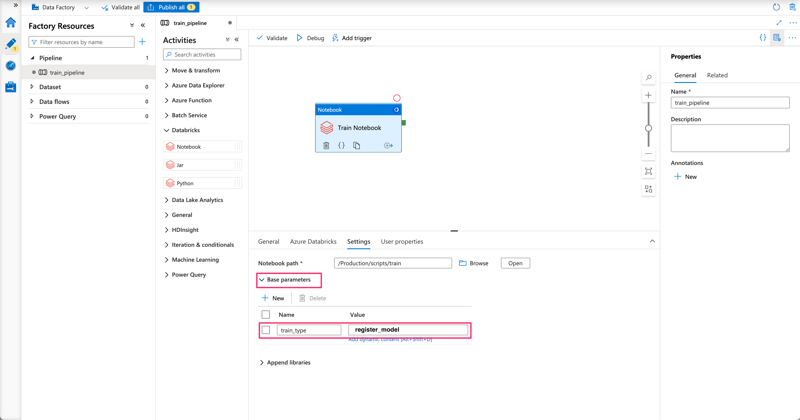

# Data & AI Tech Immersion Workshop - Product Review Guide and Lab Instructions

## Scenario overview

In this experience you will learn how Contoso Auto can use MLOps to formalize the process of training and deploying new models using a DevOps approach.
The Contoso Corporation is a fictional but representative global manufacturing conglomerate. In this tutorial we will use a train script that has already been built to create a model that will predict whether a car is a compliant car, i.e., whether it meets tightening government regulations for low-emission vehicles. The dataset contains information about the condition of car components, type of material and its manufacturing year.

## Technology overview

MLflow uses a Machine Learning Operations (MLOps) approach, which improves the quality and consistency of your machine learning solutions. 
MLflow provides the following MLOps capabilities:

- Integration with pipelines. Define continuous integration and deployment workflows for your models.
- A model registry that maintains multiple versions of your trained models.
- Model validation. Automatically validate your trained models and select the optimal configuration for deploying them into production.
- Deploy your models as a web service in the cloud, locally, or to IoT Edge devices.
- Monitor your deployed model's performance, so you can drive improvements in the next version of the model.

## AI, Experience - MLOps with MLflow and GitHub Actions <TO UPDATE ONCE FINAL>

- [Data & AI Tech Immersion Workshop - Product Review Guide and Lab Instructions](#data---ai-tech-immersion-workshop---product-review-guide-and-lab-instructions)
  * [Scenario overview](#scenario-overview)
  * [Technology overview](#technology-overview)
  * [AI, Experience - MLOps with MLflow and Azure DevOps](#ai--experience---mlops-with-azure-machine-learning-and-azure-devops)
  * [Prerequisite: resource group](#prerequisite--resource-group)
  * [Exercise 1: Setup New Project in Azure DevOps](#exercise-1--setup-new-project-in-azure-devops)
    + [Task 1: Import Quickstart code from a GitHub Repo](#task-1--import-quickstart-code-from-a-github-repo)
    + [Task 3: Create a variable group](#task-3--create-a-variable-group)
    + [Task 4: Create new Service Connection with Resource Group](#task-4--create-new-service-connection-with-resource-group)
  * [Exercise 2: Setup and Run the CI Pipeline](#exercise-2--setup-and-run-the-ci-pipeline)
    + [Task 1: Set the Databricks variables](#task-1--set-the-databricks-variables)
    + [Task 2: Setup the CI Pipeline](#task-2--setup-the-ci-pipeline)
    + [Task 3: Run the CI Pipeline](#task-3--run-the-ci-pipeline)
    + [Task 4: Review output of CI pipeline](#task-4--review-output-of-ci-pipeline)
  * [Exercise 3: Setup and Run the Train Pipeline](#exercise-3--setup-and-run-the-train-pipeline)
    + [Task 1: Setup the Azure DataFactory environment](#task-1--setup-the-azure-datafactory-environment)
    + [Task 2: Create the train pipeline](#task-2--create-the-train-pipeline)
    + [Task 3: Run the Train Pipeline](#task-3--run-the-train-pipeline)
    + [Task 4: Review Train Outputs](#task-4--review-train-outputs)
  * [Exercise 4: Setup the Development Release Pipeline](#exercise-4--setup-the-development-release-pipeline)
    + [Task 1: Create an Empty Job](#task-1--create-an-empty-job)
    + [Task 2: Add CI-Pipeline Artifact](#task-2--add-ci-pipeline-artifact)
    + [Task 3: Add Variables to notebooks to DB](#task-3--add-variables-to-notebooks-to-db)
    + [Task 4: Setup Agent Pool for Deploy Notebooks to DB stage](#task-4--setup-agent-pool-for-deploy-notebooks-to-db-stage)
    + [Task 5: Add Use Python Version task](#task-5--add-use-python-version-task)
    + [Task 6: Add Install Requirements task](#task-6--add-install-requirements-task)
    + [Task 7: Add Extract files task](#task-7--add-extract-files-task)
    + [Task 8: Add Python script task](#task-8--add-python-script-task)
    + [Task 9: Save the Release Pipeline](#task-9--save-the-release-pipeline)
  * [Exercise 5: Create Production Release Pipeline](#exercise-5--create-production-release-pipeline)
    + [Task 1: Create an Empty Job](#task-1--create-an-empty-job-1)
    + [Task 2: Add CI-pipeline Artifacts](#task-2--add-ci-pipeline-artifacts)
    + [Task 3: Add Variables to Deploy to DB](#task-3--add-variables-to-deploy-to-db)
    + [Task 4: Setup Agent Pool for Deploy Notebooks to DB stage](#task-4--setup-agent-pool-for-deploy-notebooks-to-db-stage-1)
    + [Task 5: Add Use Python Version task](#task-5--add-use-python-version-task-1)
    + [Task 6: Add Install Requirements task](#task-6--add-install-requirements-task-1)
    + [Task 7: Add Extract files task](#task-7--add-extract-files-task-1)
    + [Task 8: Add Python script task](#task-8--add-python-script-task-1)
    + [Task 9: Save the Release Pipeline](#task-9--save-the-release-pipeline-1)
  * [Exercise 6: Run the Release Pipelines](#exercise-6--run-the-release-pipelines)
    + [Task 1: Start Release pipeline](#task-1--start-release-pipeline)
    + [Task 2: Monitor Release Pipeline](#task-2--monitor-release-pipeline)
  * [Exercise 6: Query the model and make predictions](#exercise-6--query-the-model-and-make-predictions)
    + [Task 1: Run score script](#task-1--run-score-script)
  * [Wrap-up](#wrap-up)
  * [Deletion Exercise: Delete resource in the Azure Portal](#deletion-exercise--delete-resource-in-the-azure-portal)
  * [Take-Home Exercise: Test train and Release Pipelines](#take-home-exercise--test-train-and-release-pipelines)
    + [Task 1: Make Edits to Source Code](#task-1--make-edits-to-source-code)
    + [Task 2: Monitor Train Pipeline](#task-2--monitor-train-pipeline)
    + [Additional resources and more information](#additional-resources-and-more-information)

## Prerequisite: resource group

A resource group is a container for resources (Azure services). It is equivalent to a folder that contains files.

__Note__: We have already created a resource group for you, named: `RG-XXXXXX` (replace `XXXXXX` with your UniqueID). Continue with Exercise 1.

To create a resource group:
1. Go to the Azure Portal: portal.azure.com
2. Go to home and click on Resource Groups
3. Click on +Create
4. Choose your Subscription
5. Choose a name for the Resource Group (no longer than 10 characters!). For example `RG-{your initials}`
6. Set region to `(Europe) West Europe`
7. Click on -> Review + Create -> Create

## Exercise 1: Setup New Project in Azure DevOps

In this exercise you will set up a project in DevOps and import a repository that we have build for you.

Duration: 20 minutes

### Task 1: Import Quickstart code from a GitHub Repo

In this task you import a repository from GitHub. This repository mostly consists of Python files and several YAML files. The Python files will perform the Data Science steps such as training, evaluating and deploying a model. The YAML files, are used to set up the pipelines in DevOps and determine which Python files to execute in which order.

1. Within the new project:

   a. Select **Repos** from left navigation bar.

   b. Select **Import** from the content section.

   

2. Provide the following GitHub URL: TODO `https://github.com/Bramcals/MLOps-starter.git` and select **Import**. This should import the code required for the quickstart.

   

### Task 3: Create a variable group

1. Select **Pipelines**, select **Library** and select **+ Variable group**

   

2. Name the variable group: `quickstart-variablegroup` and add the following variables;

   a. `LOCATION` = `westeurope`

   b. `RESOURCE_GROUP` = `RG-XXXXXX` (replace `XXXXXX` with your UniqueID)

   c. `WORKSPACE_NAME` = `SNXXXXXX` (replace `XXXXXX` with your UniqueID)

   d. `BASE_NAME` = workspace name in lower case letter and no special characters: `snxxxxxx` (replace `xxxxxx` with your UniqueID)

   

3. Select `Save`

### Task 4: Create new Service Connection with Resource Group 

We make a connection between DevOps and the resource group.

1. From the left navigation select **Project settings** and then select **Service connections**.

   

2. Select **Create service connection**, select **Azure Resource Manager**, and then select **Next**.

   

3. Select **Service principal (automatic)** and then select **Next**.

   

4. Provide the following information for the 'New Azure service connection' and then select **Save**:

   a. Scope Level: `Subscription`

   > **Note**: If you are unable to select your **Resource group**, do the following steps:

   - Quit the `Service connection` dialog
   - Make sure Cookies are allowed by the browser
   - Refresh or reload the web browser
   - Click on create new connection
   - Perform steps 1 - 3 again
   - In step 4, change the `Scope level` to **Subscription**
   - Then a Microsoft Login windows should appear. Provide your login details
   - Now, you should be able to select your resource group
   - Name your service connection: `quick-starts-sc-rg`
   - Grant access permission to all pipelines

   b. Subscription: `VQD Data Science`

   c. Resource group: This value should match the value you just provided in the library as a variable: `RG-XXXXXX` (replace `XXXXXX` with your UniqueID)

   d. Service connection name: `quick-starts-sc-rg`

   e. Grant access permission to all pipelines: this checkbox must be selected.

   f. Select `Save`

   

## Exercise 2: Setup and Run the CI Pipeline

In this exercise, the CI/CD pipeline will be built. In the CI pipeline a code quality check will be performed on all Python files in the repository. Unit tests can also be performed in this pipeline. In unit testing you break down the functionality of your program into discrete testable behaviors that you can test as individual units. However, for the sake of this tutorial, we will only do a code quality check.
After a push to the `main` branch, the Databricks notebooks are updated in the Databricks workspace to match the Databricks notebooks in the `/scripts/` repository folder.
### Task 1: Set the Databricks variables
1. Select **Pipelines**, select **Library** and select **+ Variable group**

2. Name the variable group: `dbx-variablegroup` and add the following variables;

   a. `dbx_org_url` = `https://abs-[XXXX].azuredatabricks.net` (replace `XXXX` such that it corresponds with your Databricks environment)

   b. `dbx_token` = `XXXXXX` (replace `XXXXXX` with a Databricks token)
   
      You can create a Databricks token by going to the Databricks environment and under 'User Settings' create a new token
      
      Now you can generate a token by pressing the 'Generate New Token' button. The comment input is not relevant. In this case, "DBX_api" is chosen.
      
      
      Now copy this token to the variable `dbx_token` in the `dbx-variablegroup` variable group.

   

3. Select `Save`
### Task 2: Setup the CI Pipeline

1. From left navigation select **Pipelines, Pipelines** and then select **Create pipeline**.

   

2. Select **Azure Repos Git** as your code repository.

    

3. Select **mlops-quickstart** as your repository. test

    

4. Select **Existing Azure Pipelines YAML file**, select **/environment_setup/CICD-pipeline.yml** as your path and select continue (change figure).

   

5. Review your pipeline YAML

   1. The first stage consists of a CI pipeline, which is triggered for a push into `main`, as well as for a push into the `development` branch.

      a. The first step is to install Python

      b. The second step in this pipeline is the code quality check. It is also possible to create a report of this step. However, this is left out of scope.

      c. In the final step, all files in the `/scripts/` folder will be archived in a `.zip` file.

### Task 3: Run the CI Pipeline

1. Before running the pipeline, let us first give the pipeline a meaningful name. Select the arrow next to the run button.

    <!-- !!Change figure!! -->

2. Select **Save**

3. Select the settings button next to the **Run Pipeline** button and select **Rename/move**

    <!-- !!Change figure!! -->

4. Rename the pipeline to **CI-Pipeline**

5. Select **Run Pipeline** and press **Run**

### Task 4: Review output of CI pipeline

1. Select **Job** to view the current progress in the pipeline execution run

    <!-- !!Change figure!! -->

2. Review the steps

3. Review the code quality check. In the check it can be seen that several packages are imported but never used. The check also indicates missing or redundant white lines/space and lines exceeding the character limit. With this check, we can adjust our code and make it more pythonic to increase standardization and manageability of work.

    

## Exercise 3: Setup the Development Release Pipeline

Now that the CI pipeline has succeeded, artifacts (`/scripts/`) are available to set up the Release pipeline (sometimes called the deployment pipeline). Since we like the deployment to kick off directly after the CI pipeline has succeeded, we use a release pipeline. In this case, this deployment is triggered for a push on the `development` branch. This way, the notebooks are automatically updated to align with the notebooks in the `development` branch.

Duration: 20 minutes

### Task 1: Create an Empty Job

1. Return to Azure DevOps and navigate to **Pipelines, Releases** and select **New pipeline**.

   

2. Select **Empty job**.

   

3. Provide Stage name: `Deploy notebooks to DB` and close the dialog.

### Task 2: Add CI-Pipeline Artifact

1. Select **Add an artifact**. Select Source type: `Build`, Source: `CI-Pipeline`. Set the source alias to: `CI-pipeline`. Finally, select **Add**.

   

2. Select **Add an artifact**. Select Source type: `Azure Repositories`. Set Default branch: `development`. Set the source alias to: `development branch`. Finally, select **Add**.

   

3. Set a trigger for the artifact to release to be activated. Click on the trigger button on the `CI-Pipeline` artifact. Enable the continuous deployment trigger and set the build branch to include `development`.

   

### Task 3: Add Variables to notebooks to DB

1. Open **View stage tasks** link.

   

2. Open the **Variables** tab.

   

3. Add two pipeline variables as name - value pairs and then select **Save** (use the default values in the **Save** dialog):

These variables are needed to deploy the notebooks.

    a. Name: `source_path` Value: `$(System.DefaultWorkingDirectory)/CI-Pipeline/opsscripts/scripts'

    b. Name: `target_path` Value: `"/Development/scripts"`

4. Next add the **dbx-variablegroup** to the variable groups in the **Variable groups** tab, by clicking on **Link variable group**.

   

<!--  -->

### Task 4: Setup Agent Pool for Deploy Notebooks to DB stage

1. Open the **Tasks** tab.

   

2. Select **Agent job** and change **Agent pool** to `Azure Pipelines` and change **Agent Specification** to `ubuntu-latest`.

   

### Task 5: Add Use Python Version task

1. Select **Add a task to Agent job** (the **+** button), search for `Use Python Version`, and select **Add**.

   

2. Provide **Display name:** `Use Python 3.7` and **Version spec:** `3.7`.

   

### Task 6: Add Install Requirements task

1. Select **Add a task to Agent job** (the **+** button), search for `Bash`, and select **Add**.

   

2. Provide **Display name:** `Install Requirements` and select the **Inline** option and provide the following script:

   `# Install dependencies`

   `python -m pip install --upgrade pip`
   `pip install -r "$(System.DefaultWorkingDirectory)/development branch/environment_setup/requirements.txt"`

   

### Task 7: Add Extract files task
1. Select **Add a task to Agent job** (the **+** button), search for `Extract files`, and select **Add**.

2. Provide **Display name:** `Extract files` and set the **Archive file patterns** to `$(System.DefaultWorkingDirectory)/CI-Pipeline/opsscripts/*.zip`. And set the **Destination folder** to `$(source_path)`.

   

### Task 8: Add Python script task
1. Select **Add a task to Agent job** (the **+** button), search for `Python script`, and select **Add**.

2. Provide **Display name:** `Deploy notebooks to workspace` and set the **Script path** to: `$(System.DefaultWorkingDirectory)/development branch/db_service/notebooks_to_db_dev.py`. And set the **Arguments to** to: `-source_path "$(source_path)/scripts" -target_path $(target_path) -dbx_api_token $(dbx_token) -dbx_ws_url $(dbx_org_url)`.

   

### Task 9: Save the Release Pipeline

1. Provide name: `Dev-release-DB`.

2. Select: **Save** (use the default values in the **Save** dialog).

   

## Exercise 4: Create Production Release Pipeline

We want to create a release pipeline for the `main` branch as well. If the `development` notebooks have been successfully reviewed by other people on the team, the `main` branch can be updated with a new script. The notebooks are now brought to production. Hence, this pipeline is often defined as the production release pipeline.

Duration 15 minutes

### Task 1: Create an Empty Job

1. Return to Azure DevOps and navigate to **Pipelines, Releases** and select **New pipeline**.

   

2. Select **Empty job**.

   

### Task 2: Add CI-pipeline Artifacts

1. Select **Add an artifact**. Select Source type: `Build`, Source: `CI-Pipeline`. Set the source alias to: `CI-pipeline`. Finally, select **Add**.

   

2. Select **Add an artifact**. Select Source type: `Azure Repositories`. Set Default branch: `main`. Set the source alias to: `main branch`. Finally, select **Add**.

   

3. Set a trigger for the artifact to release to be activated. Click on the trigger button on the `CI-Pipeline` artifact. Enable the continuous deployment trigger and set the build branch to include `main`.

   

### Task 3: Add Variables to Deploy to DB

1. Open **View stage tasks** link.

   

2. Open the **Variables** tab.

   

3. Add two pipeline variables as name - value pairs and then select **Save** (use the default values in the **Save** dialog):

These variables are needed to deploy the notebooks.

    a. Name: `source_path` Value: `$(System.DefaultWorkingDirectory)/CI-Pipeline/opsscripts/scripts'

    b. Name: `target_path` Value: `"/Production/scripts"`

4. Next add the **dbx-variablegroup** to the variable groups in the **Variable groups** tab, by clicking on **Link variable group**.

   

### Task 4: Setup Agent Pool for Deploy Notebooks to DB stage

1. Open the **Tasks** tab.

   

2. Select **Agent job** and change **Agent pool** to `Azure Pipelines` and change **Agent Specification** to `ubuntu-latest`.

   

### Task 5: Add Use Python Version task

1. Select **Add a task to Agent job** (the **+** button), search for `Use Python Version`, and select **Add**.

   

2. Provide **Display name:** `Use Python 3.7` and **Version spec:** `3.7`.

   

### Task 6: Add Install Requirements task

1. Select **Add a task to Agent job** (the **+** button), search for `Bash`, and select **Add**.

   

2. Provide **Display name:** `Install Requirements` and select the **Inline** option and provide the following script:

   `# Install dependencies`

   `python -m pip install --upgrade pip`
   `pip install -r "$(System.DefaultWorkingDirectory)/main branch/environment_setup/requirements.txt"`

   

### Task 7: Add Extract files task
1. Select **Add a task to Agent job** (the **+** button), search for `Extract files`, and select **Add**.

2. Provide **Display name:** `Extract files` and set the **Archive file patterns** to `$(System.DefaultWorkingDirectory)/CI-Pipeline/opsscripts/*.zip`. And set the **Destination folder** to `$(source_path)`.

   

### Task 8: Add Python script task
1. Select **Add a task to Agent job** (the **+** button), search for `Python script`, and select **Add**.

2. Provide **Display name:** `Deploy notebooks to workspace` and set the **Script path** to: `$(System.DefaultWorkingDirectory)/main branch/db_service/notebooks_to_db_dev.py`. And set the **Arguments to** to: `-source_path "$(source_path)/scripts" -target_path $(target_path) -dbx_api_token $(dbx_token) -dbx_ws_url $(dbx_org_url)`.

   

### Task 9: Save the Release Pipeline

1. Provide name: `Prod-release-DB`.

2. Select: **Save** (use the default values in the **Save** dialog).

   

## Exercise 5: Setup and Run the Train Pipeline

In this exercise, the Train pipeline will be set up. The training pipeline will be created with Azure DataFactory, an Azure service that allows for orchestrating Data Science activities. In our case we want to orchestrate the execution of the Databricks notebooks that were deployed in the previous step. 

Duration: 25 minutes

### Task 1: Setup the Azure DataFactory environment
Before we create the Train pipeline, we need to configure the Azure DataFactory. The DataFactory needs to be linked to the Databricks workspace that was used in the previous step. To do this, we will create a Linked Service in Data Factory.

1. In the **Azure Portal** navigate to your resource group. 

1. Select the Azure DataFactory resource called **adf-[NAME]**.
     

1. Select **Open** within the **Open Azure Data Factory Studio** square.
    

1. In the left navigation bar click on the blue **Toolbox icon** to open the **Manage screen**.
    

1. Select the blue **Plus icon** next to the text **New** to create a new Linked Service
    

1. Select **Compute** next to **Data store**
    

1. Select **Azure Databricks**
    

1. Configure the Azure Databricks linked service
   1. Name: AzureDatabricks
       
   1. Azure subscription: TODO: provide name
       
   1. Databricks workspace: adb-[NAME]
       
   1. Select cluster: Existing interactive cluster
       
   1. Generate an access Token for Databricks
      1. Go to your Databricks workspace
      1. Select **Settings** icon and then **User Settings** in the lower left corner of your Databricks workspace.
          
      1. Select the **Generate New Token** button in the **Access Tokens** tab
          
      1. Provide a name and select **Generate**
          
      1. Copy the token with CTRL + C or right clicking the token text and select copy
          
   1. Go back to your Azure Databricks linked service and paste the Access Token inside the **Access Token** field (CTRL + V or right clicking and select paste) **
        
       _** Please note: in practice it is not recommended to copy and paste Access Tokens manually. Instead of this, use an Azure KeyVault to store any credentials. For this training and simplicity purposes we have not used an Azure KeyVault._

   1. Existing cluster id: Select one of the existing clusters
        

1. Create the linked service by selecting **Create** at the bottom
    

### Task 2: Create the train pipeline
Now that we configured the Data Factory, we need to create the train pipeline that trains and validates a model.

1. In the left navigation bar select the blue **Pencil icon** to open the **Author screen**.
    
1. Select the blue **Plus icon** next to **Filter resources by name**, select **Pipeline** and select **Pipeline** again.
    
1. On the right provide a **Name** for the DataFactory pipelines
    
1. On the left select **Databricks** (under **Activities**) and then drag **Notebook** into the white canvas on the right.
    

1. Configure the Notebook activity for training
   1. Provide a **Name** for the **Azure Databricks Notebook** 
       
   1. Select **Azure Databricks** from the navigation bar in the middle of the screen and select the **AzureDatabricks** linked service from the dropdown menu
       
   1. Write **/Production/scripts/train** in the text field on **Notebook path**
        
   1. Expand the **Base parameters** by clicking on the arrow next to **Base parameters**
      1. Select **New** 
      1. Configure the parameter
         1. Name: train_type
         2. Value: adf_pipeline
       

1. On the left select **Databricks** again and then drag **Notebook** into the white canvas on the right.

1. Configure the Notebook activity for validation using the same approach as with the training activity
   1. Select **Azure Databricks** from the navigation bar in the middle of the screen
   1. Select **AzureDatabricks** from the dropdown menu next to **Databricks linked service**
   1. Select **Setting** from the navigation bar in the middle of the screen
   1. Write **/Development/scripts/validate** in the text field on **Notebook path**
   1. Expand the **Base parameters** by clicking on the arrow next to **Base parameters**
   1. Select **New** 
   1. Configure the parameter
      1. Name: validate_type
      2. Value: adf_pipeline

1. Connect the Training activity and the Validation activity (by dragging the green box on the right of train activity to the validation activity)
    

### Task 3: Run the Train Pipeline
Now that we have the Train Pipeline, we will run the pipeline by triggering a Debug run.

1. Select **Debug** in the navigation bar at the top (right of **Save as template**, **Validate**)
    

1. Monitor the Pipeline run at the bottom of the screen

1. Once the Pipeline has run you can view its content by clicking on it
    
   
### Task 4: Review Train Outputs

1. Log in to Go to your Databricks workspace. Make sure you select **Machine Learning** so you can access the models section. Open your **Models** section, and observe the versions of the registered model: `classifier`. The latest version is the one registered by the train pipeline you have run in the previous task.

   
       

2. Select the latest version of your model to review its properties. Notice the `Soure Run` tag which links the registered to model to the Experiment that generated it.

   

3. Click on the Source Run and observe the parameters and metrics for the experiment that created this model.

   

4. Scroll down and review the model artifacts that were created for this model.

   

## Exercise 6: Run the Release Pipelines

In this exercise you will execute the release pipeline and use the artifact from the previous train pipeline to deploy a model. Normally the release pipeline would be executed when the train pipeline has finished. Therefore, we would have to restart the train pipeline. Due to time constraints we will not do this, but instead trigger the release manually.

### Task 1: Start Release pipeline

1. Navigate to **Pipelines, Releases** and select **create release**

   

2. Select **Create**. Note that you can also activate a single automatic trigger here, instead of automatically triggering every time a new build artifact is available from the train pipeline (like we have done now)

   

### Task 2: Monitor Release Pipeline

1. Navigate to **Pipelines, Releases**. Observe that the Release pipeline is automatically triggered upon successful completion of the Train pipeline. Click on the button shown in the figure to view pipeline logs.

   

2. The release pipeline will run for about 5 minutes. Proceed to the next task when the release pipeline successfully completes. Proceed to start the Production release pipeline.

3. After the release pipelines are finished, confirm that the workspace folders are updated and filled with the notebooks that are in the Git repository.

## Exercise 6: Query the model and make predictions

In this exercise, you will provide the model with data points and receive a prediction back. Now that we have a deployed model, an API call can be made.

Duration: 5 minutes

### Task 1: Run score script

1. Open the Databricks workspace.

2. Navigate to the script `scripts/score.py`, which is located in the current repository. 

3. Follow the instructions in the notebook to load your model and the data. Apply the model to the loaded data and an individual sample.

## Wrap-up

Congratulations on completing this tutorial.
If you want to continue practicing with ML Ops, we have created additional exercises. Find out about automation and continous integration of ML Ops with the following exercise [link](#Additional-Exercise-Test-train-and-Release-Pipelines).
If you no longer intend to use your Azure Portal subscriptions with your created resources, please do not forget to delete your resources. Instructions on how to delete your resources are provided in the following exercise [link](#Deletion-Exercise-Delete-resource-in-the-Azure-Portal)

To recap, in this tutorial you learned about:

1. Creating a Continuous Integration Pipeline to support continuous development.

2. Creating a Train Pipeline to support model training.

3. Creating a Release Pipeline to support model deployment.

## Deletion Exercise: Delete resource in the Azure Portal

Don't forget to delete your resource on the Azure Portal if you don't have a free subscription. With a free subscription everything will automatically be deleted after 30 days, so you still have some time to practice after this tutorial.

If you don't have a free subscription and you would like to delete all your resources, do the following;

1. Open the [Azure Portal](https://portal.azure.com/)

2. Go to Resource Groups and find you Resource Group.

3. Click on "Delete Resource group" in the top menu bar.

## Take-Home Exercise: Test train and Release Pipelines

Now that we have set up the release pipeline, it can be tested by executing the train pipeline and checking whether the release is automatically triggered to deploy the model. You will execute the train pipeline, by changing some parameters of the algorithm in the training step. This change, will trigger the pipeline to be automatically executed. Once it is done, an artifact is available and the release is triggered. Note: the model will only be deployed if the trained model has a higher accuracy score than the current deployed model.

Duration: 30 minutes

### Task 1: Make Edits to Source Code

1. Navigate to: **Repos -> Files -> scripts -> `train.py`**.

2. **Edit** `train.py`.

3. Change the learning rate **(learning_rate)** of the model from **0.1** to **0.001**.

4. Change the number of estimators **(n_estimators)** from **10** to **30**.

5. Select **Commit**.

   

6. Provide comment: `Improving model performance: changed learning rate.` and select **Commit**.

   

### Task 2: Monitor Train Pipeline

1. Navigate to **Pipelines, Pipelines**. Observe that the train pipeline is triggered because of the source code change.

   

2. Select the pipeline run and monitor the pipeline steps. The pipeline will run for 16-18 minutes. After the model has been trained, check whether the release pipeline is triggered and the new model is deployed.

   

### Additional resources and more information

To learn more about MLOps with the MLflow service, visit the [documentation](https://www.mlflow.org/docs/latest/index.html)
